# Ubuntu装机教程

Author：谢世宽-SDU  
Edit Date: 2021-11-14

---

## *几个概念*

这一部分可以跳过，但是需要看的话可以回来看一下

1. 计算机系统的引导方式大概分为Legacy和UEFI两类，新买的计算机（大概2016年以后）大部分默认是UEFI。
2. 硬盘的格式有MBR和GPT两类，新的硬盘也都默认是GPT。目前主流的搭配方式是UEFI+GPT，本教程也是按照这种搭配，如果你的电脑年代比较久远，本教程可能不适用。
3. Ubuntu的名字中的数字代表它的发布时间，点前面的是年份，点后面的是月份。会在每年的4月和10月发布两个版本，例如2018年4月发布的就称为Ubuntu18.04，在2021年10月发布的就叫Ubuntu21.10。这些版本中在双数年4月发布的版本为长期支持版本(Long Term Support - LTS)，也是用的人最多的版本。例如Ubuntu18.04和Ubuntu20.04。
4. Ubuntu每个版本都有自己对应的名字，例如Ubuntu16.04叫做Xenial、Ubuntu18.04叫做Bionic、Ubuntu20.04叫做Focal。
5. Ubuntu中经常使用的终端命令`sudo`是超级用户操作(super user do)的意思。需要操作根目录下非/home/user/中的内容时一般需要加上该命令。
6. `sudo apt update`的作用是更新软件列表索引，`sudo apt upgrade`是更新软件。

## 需要准备的东西

1. 一台拥有Windows操作系统的电脑，用来制作启动盘
2. 一个容量大于8G的U盘，用来作为启动盘

## 设置BIOS
首先需要启动待安装系统的电脑并进入BIOS  
关闭安全启动，设置系统引导方式为UEFI（一般默认都是UEFI）  
不同品牌的电脑BIOS设置方式不同，这一步可以查询自己的电脑型号按照网上的教程来

## 硬盘分区
使用需要安装Ubuntu系统的电脑，桌面**计算机**（也就是我的电脑）右键选择**管理**

左侧选择**存储**中的**磁盘管理**

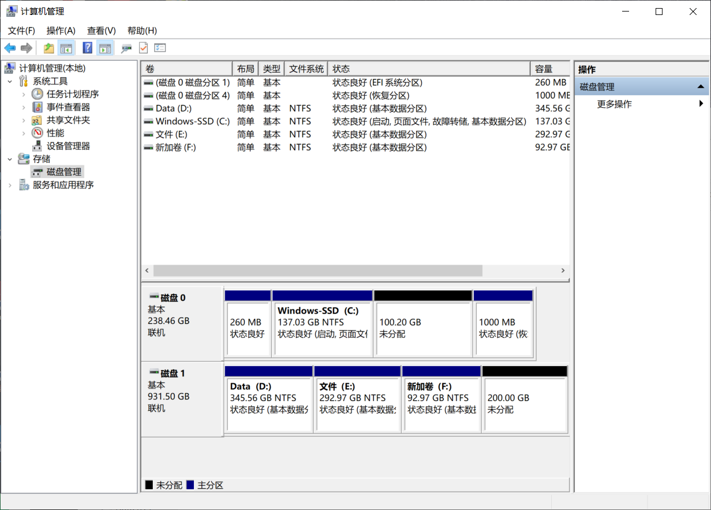

在下面的磁盘中进行分区。如果有固态硬盘最好将系统安装在固态硬盘中，最好分区不少于100G作为系统盘。如果觉得空间太小，可以从机械硬盘中分一些空间作为挂载硬盘。
例如在本图中，磁盘0分了100G用来装Ubuntu系统，磁盘1分了200G用来作为挂载，硬盘挂载将在后文中详细说明。  
*注意：可以在磁盘0或磁盘1上右键，可以看到有一栏灰色的* ***转为MBR*** *字样，这说明硬盘当前类型为GPT，这对后面烧录U盘启动盘非常重要。一般新的电脑硬盘都是GPT格式。*

## 下载镜像和烧录工具

### 系统镜像
打开[Ubuntu官方下载网站](https://ubuntu.com/download/desktop)下载Ubuntu系统镜像

*注意选择自己需要的Ubuntu版本，如果有特殊需求可以选择旧版本的Ubuntu，例如Ubuntu18.04。[旧版本下载地址](https://releases.ubuntu.com/?_ga=2.179403111.257598562.1634629355-455569943.1634629355)
但一般2019年以后新的**笔记本电脑**，由于主板显卡和旧版Linux内核的兼容问题，在安装Ubuntu18.04及以前版本时可能会出现ACPI错误。  
如果遇到这个问题可以通过尝试禁用UEFI启动，改用Legacy来安装Ubuntu18.04。但是安装过程非常麻烦，不同的电脑具体方式也各不相同，本教程不提供此流程。
如果在安装Ubuntu18.04的过程中出现ACPI错误，建议直接安装Ubuntu20.04，截止2021年10月，20.04的软件生态已经非常好了，除部分开源代码自己的问题，20.04一般不会遇到大的问题。如果有，可以自己手动改代码，或者使用18.04的Docker来解决（不会2021年了还有人在用18.04叭？不是，不会还有人在用16.04叭？）*

### 烧录工具
建议使用Ubuntu官方烧录工具[Rufus](https://rufus.ie/zh/)

系统镜像和烧录工具准备好后如下图  
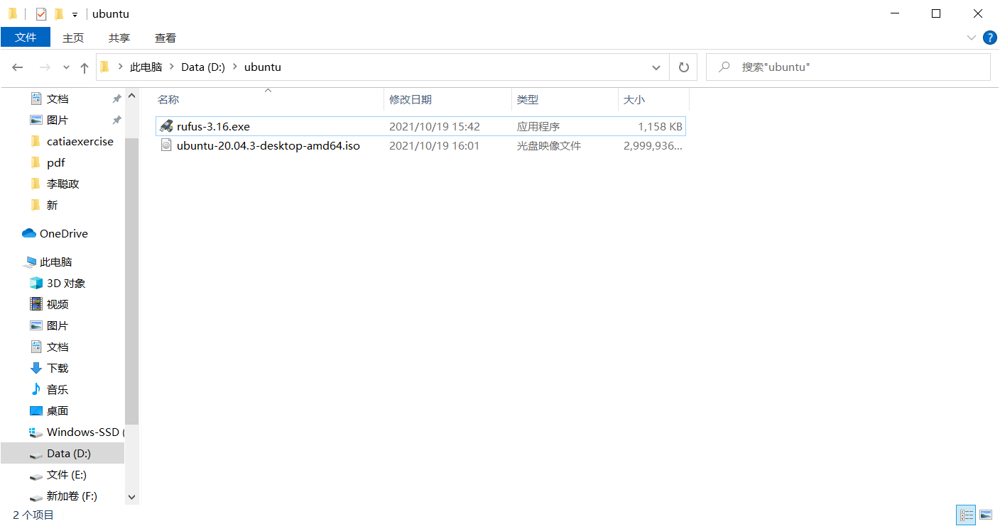

## 制作启动盘
插入需要烧录的U盘，并双击打开Rufus，界面如下图所示  
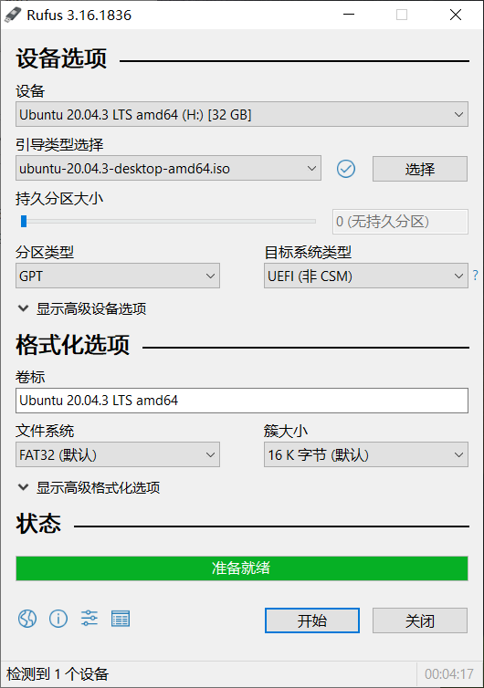  
第一个选项**设备**应当选择需要烧录的U盘  
下面的**引导类型选择**应当选择下载好的Ubuntu系统镜像  
**分区类型**选择GPT（如上文硬盘分区一节中所查）  
**目标系统类型**选择UEFI  
下面几项均为默认，并点击下面的开始  

等待烧录完成，状态栏会由灰色变成如上图的绿色并显示准备就绪，此时已经烧录完成，不用再点开始

制作启动盘已经完成，下面可以开始安装系统

## 安装系统

### 进入启动盘
重启计算机，并根据自己的电脑进入选择启动项界面  
*一般为F2 F8 F9 F12等，根据自己的电脑型号在网上查一下，或直接按ESC终止启动*
在启动项中选择U盘  
*如果是笔记本电脑安装Ubuntu18.04 在这一步可能会遇到黑屏并显示有ACPI错误字样 如果遇到请参考前文内容*

### 安装Ubuntu
随后会显示如下图黑色界面  
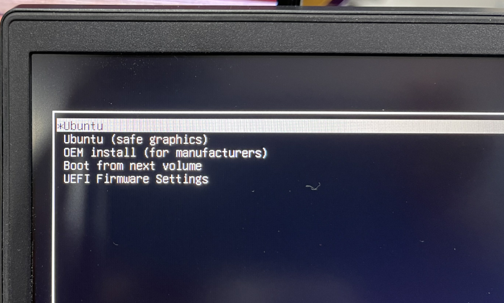  
选择第一个**Ubuntu**  
跳转进入如下界面  
  
*建议所有的语言选项都选择英语，因为选择中文在使用过程中可能会遇到很多中文路径错误的问题*  
选择右边的**Install Ubuntu**  
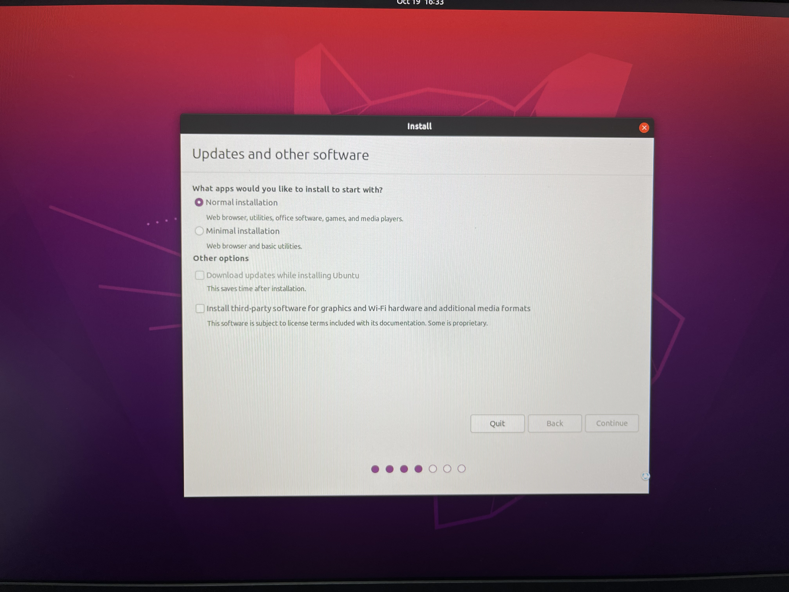  
在上图中选择**Normal installation**  
*建议在安装过程中拔掉网线并关闭WiFi。因为即便在这幅图的界面中没有选择下载更新和第三方软件，如果在网络环境中，Ubuntu仍然会联网下载语言包等内容，而且速度极慢，建议安装完成后更换APT源后再下载，速度会快很多*  
  
如果你的计算机中Windows独占一个硬盘，另外分出了一个完整的硬盘，可以直接选择第一项*Install Ubuntu alongside Windows Boot Manager*，Ubuntu会自动安装在空的硬盘中。  
但如果你的分区方式像上文中那样，有多个空闲分区，并且分区位置比较乱，不建议使用自动安装，Ubuntu可能会安装到你意想不到的地方。  
建议选择第三个*Something else*手动选择安装位置。  
  
如果上一步选择了*Something else*，那么会看到这个界面。  
在这里选择你之前分好的分区，通过**nvme0n1**和**sda**来判断是哪块硬盘，找到**Device**一栏中**free space**的分区。  
如果有多个free space，则可以通过后面的**Size**来判断具体哪块分区是需要安装Ubuntu系统的。  

下面的**Device for boot loader installation:**可以直接选择你所选分区的那块硬盘  
例如，如上图中所示，需要安装系统的free space位于*/dev/nvme0n1p3*和*/dev/nvme0n1p4*之间，因此可以判断出系统安装在*/dev/nvme0n1*这块硬盘上，于是下面直接选择*/dev/nvme0n1*。  
*一点解释：在网上大多数教程中可能会建议你单独分出一个efi分区作为boot loader的安装位置，但是在实际测试中发现并不需要如此。因为这块硬盘还有Windows的启动项，Ubuntu会将自己的启动项安装在Windows路径旁。如果这是一块全新的硬盘，也就是没有Windows的efi分区，安装程序会提醒并建议你分出一个efi分区。*  

全部选好后点击右下角的**Install Now**  
  
在弹出的对话框中只需要将最后一个**Mount point**选为**/**，意思是将这个分区挂载为系统的根目录。其他的选项均不需要修改。  

  
在弹出的对话框中选择**Continue**  

  
上图界面中输入用户名称、计算机名称和密码  
***强烈建议名称和密码都设置的短一些，其中computer's name会根据第一行的your name自动生成一段很长的前缀，建议全部删除保持和第一行的名称一致即可。因为计算机名会出现在终端每一行的前面，如果很长的话每行命令前一半都是计算机名，体验极差。
另外这个密码不只是在开机时使用，在使用一些需要管理员权限的操作时会频繁使用，因此建议尽量的短，3到6位纯数字即可***  
点击**Continue**后系统自动安装，安装过程大概需要1~2分钟。  
安装完成后根据提示拔掉启动盘并重启即可。  
重启后会进入到Grub中，以后每次开机都会先进到这个界面，选择第一个Ubuntu就可以进入新安装的系统中。

## 面对一个新系统建议做的事情

### 换源
ubuntu官方APT源的速度很慢，建议更换国内的镜像源。  
在校园网环境下建议使用[中科大源](https://mirrors.ustc.edu.cn/help/ubuntu.html)和[清华源](https://mirrors.tuna.tsinghua.edu.cn/help/ubuntu/)

以中科大源为例（清华的APT源网页做的更好一点，但是清华的ROS源没有Noetic版本的镜像源坏了，所以我都用中科大的了）

在百度直接搜索**中科大镜像源**  
选择这个  
  
在下一个网页的红框位置输入**Ubuntu**，并点击第一栏最后面的**Help**  
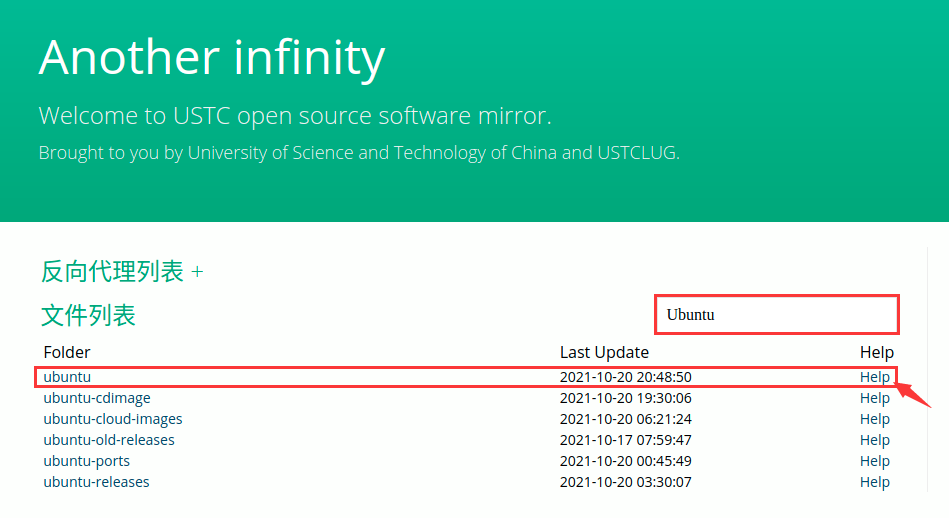  
找到网页中下位置，如图  
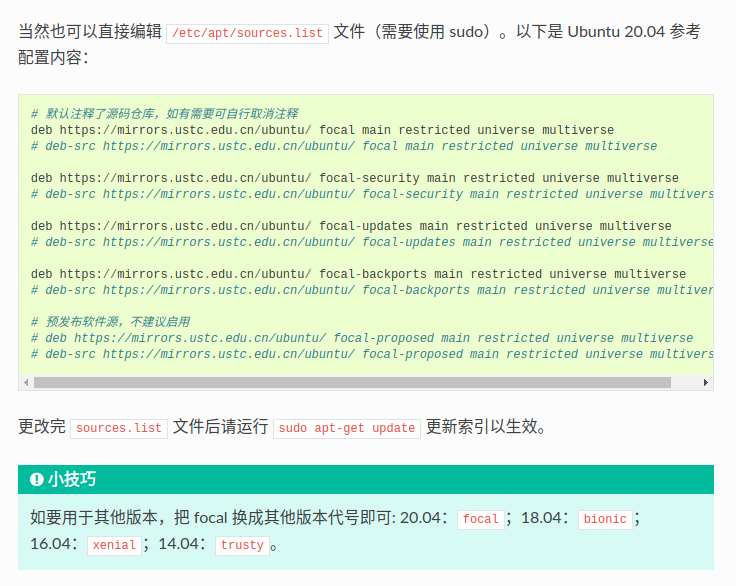  
复制绿色框中的配置内容，粘贴到*/etc/apt/sources.list*中  
具体操作：  
新建终端并输入命令  
```sh
sudo gedit /etc/apt/sources.list
```
输入密码后将上述内容粘贴进去并保存  
*如果你安装的是Ubuntu18.04 需要将其中的focal字样更换为bionic，其他版本Ubuntu同理*  
最后更新软件
```sh
sudo apt update
sudo apt upgrade
```
可以看到中间的网址已经更改为中科大的网址，说明换源成功。

### 安装显卡驱动
网上安装显卡驱动的教程大多数都是手动安装驱动程序文件，安装过程中还要禁用虚拟显卡，关闭图形界面等等操作  
这种方法太麻烦了，对新手一点也不友好，也完全没有必要，所以不建议按照网上的方法来

其实Ubuntu本身就提供了驱动程序的管理软件  
在软件菜单中搜索**software** 找到**software & updates** 图标如下图  
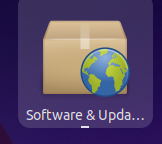  
打开在标签栏中选择第五个 **Additional Drivers**  
显示如下  
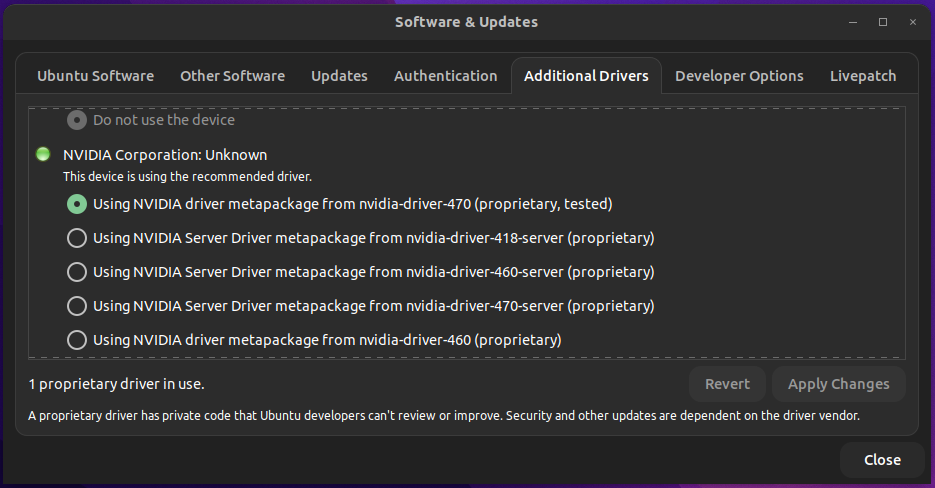  
在下面选择最新的显卡驱动 例如nvidia-driver-470（个人电脑选择不带server的即可）  
随后点击右下角的**Apply Changes**  
等待安装完成后重启电脑  

验证显卡驱动是否安装成功有两种方法：  
1. 打开设置 找到左侧菜单中最下面的**Details** 随后在右侧可以看到计算机的部分信息 如果Graphics能够显示显卡名称则说明显卡驱动安装成功 如下图  
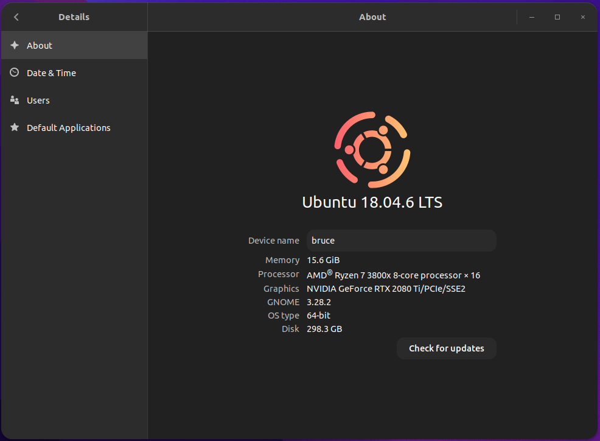  
2. 在终端中输入命令`nvidia-smi` 能够显示显卡信息则说明驱动安装成功 如下图  
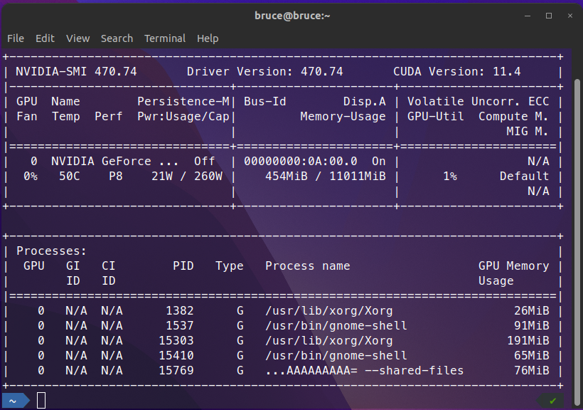

### 挂载硬盘
举个例子，我要将我电脑中的uData2这个硬盘分区（如下图）挂在到我的home下  
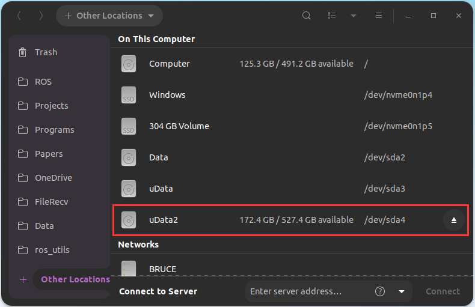  
首先看到uData2的最右侧，写着/dev/sda4，这是分区的编号，记住它  
在终端中输入`sudo blkid`，将显示你电脑上所有的硬盘分区信息  
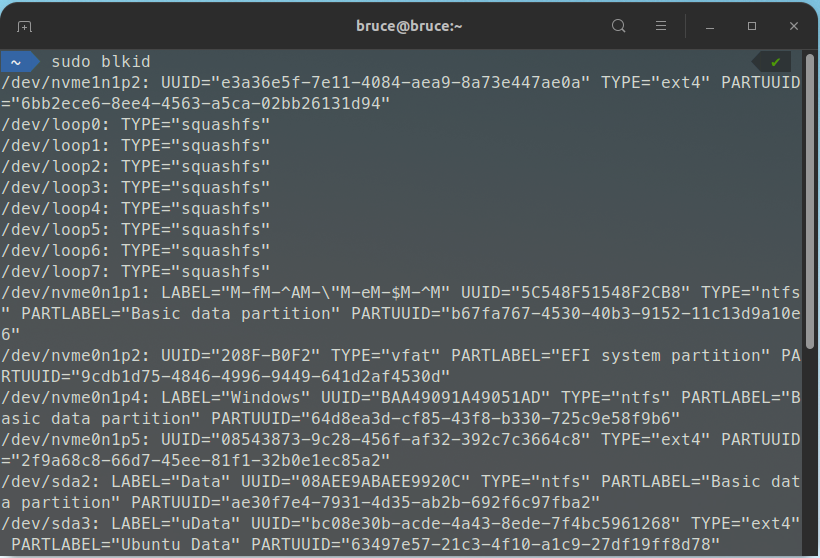  
根据前面的硬盘分区编号找到你想要挂载的分区，或者直接使用`grep`命令查找  
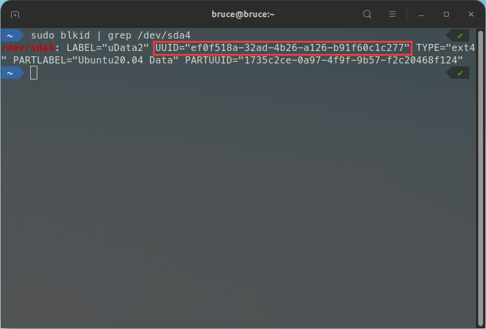  
找到这个分区的UUID编号  
*分区的编号，例如/dev/sda4，是会随着你的分区变化而变化的。例如你将/dev/sda3又进行了分区，那么sda4就会顺延为sda5，那么你的挂载路径就会出现问题。而UUID是分区的唯一识别码，除非你对这一分区进行修改，否则不会改变，因此更建议使用UUID挂载硬盘。*

在你要挂载的路径下新建文件夹  
例如我要挂载到`~/Data`  
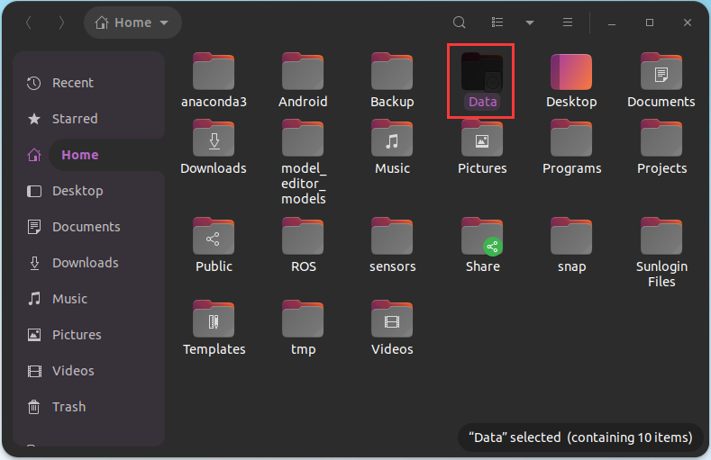

然后在终端中输入`sudo gedit /etc/fstab`  
并在最下面添加挂载信息  
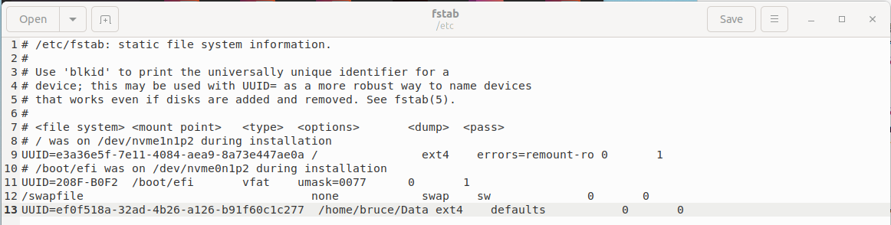  
挂载信息共有6部分，如第7行所示  
1. [file system] 为要挂载的硬盘的名字，可以用/dev/sda4，也可以用UUID，如上述原因建议使用UUID
2. [mount point] 为要挂载到的路径
3. [type] 为硬盘的格式，linux系统的存储使用的格式通常使用ext4
4. [options] 为挂载选项，例如读写权限等，使用默认即可
5. [dump] 为备份选项，设置为0即可
6. [pass] 为磁盘检查选项，设置为0即可

添加完成后保存修改并重启电脑

*如果挂载完成后出现读写权限问题，可以使用`chown`命令更改路径的用户组*